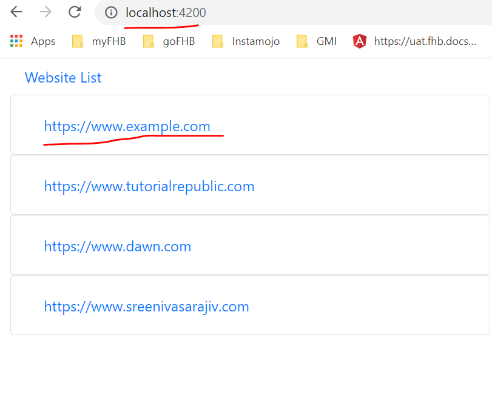
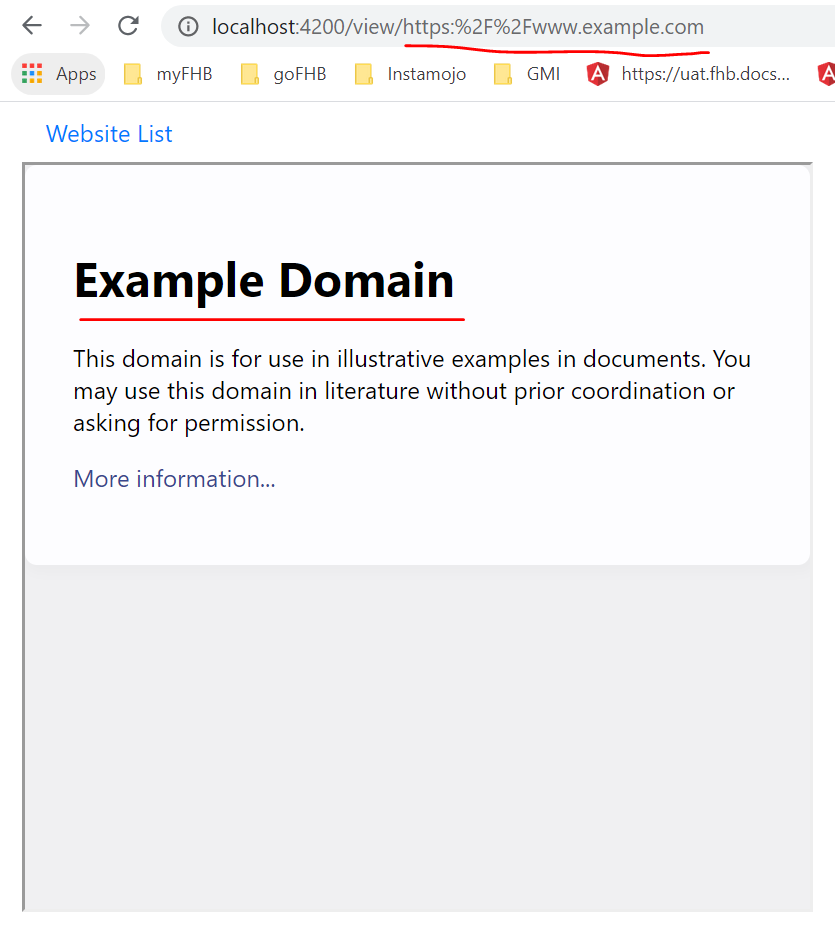

# Website Renderer

#### Assessment:
['./payoda-assessment.txt'](./payoda-assessment.txt)

#### How to run:

##### Back End:
            cd backend
            npm i
            npm run

Server will be running on Port: __3000__

##### Front End:
            cd frondend
            npm i
            ng serve

Ng App will be running on Port: __4200__

* Open [http://localhost:4200]('http://localhost:4200')

## Screenshots:

